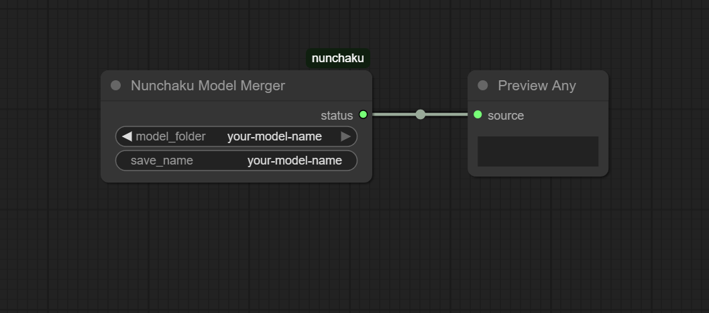

# DeepCompressor Guide: Creating SVDQuants

A practical, step-by-step guide for creating SVDQuants (Singular Value Decomposition Quantizations) of diffusion models using [DeepCompressor](https://github.com/nunchaku-tech/deepcompressor).

The Nunchaku team built an excellent quantization tool, but practical documentation was limited. This guide fills that gap with real-world instructions and pre-configured settings.

## 📦 Pre-Made Models

Check out [my HuggingFace profile](https://huggingface.co/spooknik) for ready-to-use SVDQuants I've already created.

---

<a href='https://ko-fi.com/B0B21MPRDT' target='_blank'></a>

---

## 📋 Table of Contents

1. [Before You Start: Important Considerations](#before-you-start)
2. [Step 1: Environment Setup](#step-1-environment-setup)
3. [Step 2: Configure Your Model](#step-2-configure-your-model)
4. [Step 3: Create Baseline (Optional)](#step-3-create-baseline-optional)
5. [Step 4: Prepare Calibration Dataset](#step-4-prepare-calibration-dataset)
6. [Step 5: Run Quantization](#step-5-run-quantization)
7. [Step 6: Convert for Deployment](#step-6-convert-for-deployment)
8. [Configuration Reference](#configuration-reference)
9. [Troubleshooting](#troubleshooting)

---

## Before You Start

### Supported Models
- **Flux.1** (Dev and Schnell) - This guide covers this
- **SANA**
- **PixArt**
- Coming soon: Qwen, WAN

### Hardware Requirements

⚠️ **You need serious hardware for this:**

**GPU (VRAM):**
- **Minimum:** 48GB (slow, lower quality results)
- **Recommended:** 200GB Container Size
- **Optimal:** 96GB
- **My pick:** RTX Pro 6000 Blackwell (96GB, more affordable than H100)

**CPU:**
- Don't skimp here! Single-core performance matters a lot for this workload.

**Time:**
- Expect **18-20 hours per quantization** for Flux.1 Dev models
- Budget accordingly if using cloud GPUs (time × hourly rate)

**Cloud GPU Providers:**
- [RunPod](https://runpod.io)
- [Vast.ai](https://vast.ai)

---

## Step 1: Environment Setup

I've created an automated setup script that handles everything: PyTorch, Poetry, DeepCompressor, dependencies, and configurations.

### Run the Installation Script

```bash
cd /workspace  # or wherever you want to work
wget https://raw.githubusercontent.com/spooknik/deepcompressor-guide/refs/heads/main/install_deepcompressor.sh
chmod +x install_deepcompressor.sh
./install_deepcompressor.sh
```

**What this script does:**
1. Installs system dependencies
2. Installs Poetry (Python package manager)
3. Installs PyTorch 2.8.0 with CUDA 12.8
4. Clones DeepCompressor
5. Downloads config files from this repository
6. Fixes critical bug in DeepCompressor's dependencies (`pyav` → `av`)
7. Sets exact package versions to avoid conflicts
8. Configures environment variables for optimal performance
9. Prompts for HuggingFace authentication

**Time:** ~10 minutes depending on internet speed

**HuggingFace Login:**
- When prompted, paste your HF token (get it from https://huggingface.co/settings/tokens)
- Or skip and login later: `huggingface-cli login`

### Verify Installation

```bash
cd /workspace/deepcompressor
poetry run python test_installation.py
```

---

## Step 2: Configure Your Model

Before quantizing, you need to configure your specific model. The config files are in `/workspace/deepcompressor/configs/`.

### Edit the Model Configuration

Open and modify `configs/models/your-model.yaml`:

```yaml
pipeline:
  name: CenKreChro  # Your model's name
  path: Tiwaz/CenKreChro  # HuggingFace repo path
  dtype: torch.bfloat16

eval:
  num_steps: 25  # Number of inference steps
  guidance_scale: 1  # CFG scale
  num_samples: 128  # Number of images to generate for evaluation
```

**Important:** Update the `quant.calib.path` to match your model name:

```yaml
quant:
  calib:
    batch_size: 32
    path: datasets/torch.bfloat16/YOUR-MODEL-NAME/fmeuler25-g1/qdiff/s128
```

### Choose Quantization Method

Available configs in `configs/svdquant/`:
- **`int4.yaml`** - 4-bit integer quantization (most common)
- **`nvfp4.yaml`** - NVIDIA FP4 format
- **`gptq.yaml`** - GPTQ method
- **`fast.yaml`** - Faster processing (5 grids vs 20, fewer samples)

The `fast.yaml` speeds up quantization but may reduce quality slightly. Combine it with other configs:

```bash
# Standard quality (slow)
configs/svdquant/int4.yaml

# Faster processing (recommended)
configs/svdquant/int4.yaml configs/svdquant/fast.yaml
```

---

## Step 3: Create Baseline (Optional)

**Recommended but not required.** This step samples the full-precision model to create reference metrics for comparison.

**Time:** 2-3 hours

```bash
cd /workspace/deepcompressor
poetry run python -m deepcompressor.app.diffusion.ptq \
    configs/models/your-model.yaml \
    --output-dirname reference
```

**What this does:**
- Generates images using the original BF16/FP16 model
- Creates baseline metrics (FID, CLIP scores, etc.)
- Saves to `baselines/` directory
- Allows objective quality comparison after quantization

**Sample count options:**
- `4` - Speedrun, don't care about evaluation results
- `128` - Fast, less accurate comparison
- `256` - Balanced (my recommendation)
- `1024` - More accurate, takes longer
- `5000` - Default, very thorough but very slow

Adjust by modifying `num_samples` in your model config.

---

## Step 4: Prepare Calibration Dataset

DeepCompressor needs sample images to calibrate the quantization. This step generates those images using your model.

**Time:** 30-60 minutes

```bash
cd /workspace/deepcompressor
poetry run python -m deepcompressor.app.diffusion.dataset.collect.calib \
    configs/models/your-model.yaml \
    configs/collect/qdiff.yaml
```

**What this does:**
- Loads prompts from `configs/prompts/qdiff.yaml`
- Generates 128 images (configurable in `configs/collect/qdiff.yaml`)
- Saves calibration dataset to the path specified in your model config
- These images are used to measure activation ranges during quantization

**Customize sample count:**

Edit `configs/collect/qdiff.yaml`:
```yaml
collect:
  num_samples: 128  # Increase for better calibration, decrease to save time
```

---

## Step 5: Run Quantization

This is the main event. Quantization takes the longest - budget **18-20 hours** for Flux.1 models.

```bash
cd /workspace/deepcompressor
poetry run python -m deepcompressor.app.diffusion.ptq \
    configs/models/your-model.yaml \
    configs/svdquant/int4.yaml \
    configs/svdquant/fast.yaml \
    --eval-benchmarks MJHQ \
    --eval-num-samples 256 \
    --save-model output/quantized
```

**Command breakdown:**
- `configs/models/your-model.yaml` - Your model configuration
- `configs/svdquant/int4.yaml` - Quantization method (4-bit integer)
- `configs/svdquant/fast.yaml` - Speed optimization (optional)
- `--eval-benchmarks MJHQ` - Evaluate against MJHQ benchmark
- `--eval-num-samples 256` - Number of images for evaluation
- `--save-model output/quantized` - Where to save the quantized model

**Monitor progress:**

Open another terminal and watch GPU usage:
```bash
watch -n 1 nvidia-smi
```
or
```bash
nvtop
```


**What happens during quantization:**
1. Loads your full model into memory
2. Applies smooth quantization to reduce errors
3. Performs low-rank decomposition on weights 
4. Quantizes weights and activations to 4-bit
5. Evaluates quality against calibration and benchmarks
6. Saves quantized checkpoint

---

## Step 6: Convert for Deployment

After quantization completes, convert the checkpoint to Nunchaku's deployment format.

**For Int4**
```bash
cd /workspace/deepcompressor
poetry run python -m deepcompressor.backend.nunchaku.convert \
  --quant-path output/quantized \
  --output-root output/deployed \
  --model-name your-model-name
```

**For Fp4**
```bash
cd /workspace/deepcompressor
poetry run python -m deepcompressor.backend.nunchaku.convert \
  --quant-path output/quantized \
  --output-root output/deployed \
  --model-name your-model-name \
  --float-point
```

**Parameters:**
- `--quant-path` - Path to quantized checkpoint from Step 5
- `--output-root` - Where to save deployment files
- `--model-name` - Name for the deployed model
- `--float-point` - Must be used for FP4

**Output files:**
The converted model will be in `output/deployed/your-model-name/`. 
---

## Step 7: Merge into single .safetensors

The outpout of the previous command leaves us with two `.safetensors` files, which we need to merge together to get something we can use in ComfyUI. 

Download `transformer_blocks.safetensors` and `unquantized_layers.safetensors
` and place them in a folder in `ComfyUI\models\unet\your-model-name`

Create this workflow and run it (or drag this image into ComfyUI)



Now in `ComfyUI\models\unet` you have the finished merged SVDQuant! 

## Configuration Reference

### Directory Structure

```
configs/
├── models/
│   └── your-model.yaml          # Model-specific settings
├── svdquant/
│   ├── __default__.yaml         # Base quantization settings
│   ├── int4.yaml                # 4-bit integer quantization
│   ├── nvfp4.yaml               # NVIDIA FP4 quantization
│   ├── gptq.yaml                # GPTQ method
│   └── fast.yaml                # Speed optimization
├── collect/
│   └── qdiff.yaml               # Calibration collection settings
└── prompts/
    ├── qdiff.yaml               # General prompts
    └── lora/                    # LoRA-specific prompts
```

### Key Configuration Parameters

**Batch Sizes** (in model config):

If you encounter out-of-memory errors, reduce these values:

```yaml
quant:
  calib:
    batch_size: 32  # Lower if OOM

  wgts:
    calib_range:
      element_batch_size: 128  # Try 64 if OOM
      sample_batch_size: 32    # Try 16 if OOM
```

**Skip Patterns:**

These layers are sensitive to quantization and should be skipped:
- `embed` - Embedding layers
- `resblock_*` - ResNet components
- `transformer_proj_*` - Transformer projections
- `transformer_norm` - Normalization layers
- `down_sample` / `up_sample` - Resolution changes

Don't modify these unless you know what you're doing!

---

## Troubleshooting

### Out of Memory Errors

1. **Reduce batch sizes** in your model config (see above)
2. **Use `fast.yaml`** to reduce memory pressure
3. **Lower `num_samples`** in calibration and evaluation
4. **Close other GPU applications**

### "Module 'av' not found"

The install script should fix this automatically, but if you see this error:

```bash
cd /workspace/deepcompressor
sed -i 's/pyav = ">= 13.0.0"/av = ">= 13.0.0"/' pyproject.toml
poetry run pip install av>=13.0.0
poetry install
```

### Model Download Fails

Make sure you're authenticated with HuggingFace:

```bash
huggingface-cli login
```

Some models require accepting terms on their HuggingFace page first.

### Quantization Takes Forever

- This is normal! Flux.1 takes 18-20 hours for quality quantization
- Ensure you're using a powerful CPU and not in powersave (check with `htop`)
- Make sure GPU isn't throttling (check temps with `nvidia-smi`)
- Consider using `fast.yaml` for quicker (but potentially lower quality) results

### Results Look Bad

1. **Increase calibration samples:** Edit `configs/collect/qdiff.yaml` and increase `num_samples`
2. **Remove `fast.yaml`:** Use full grid search (20 grids instead of 5)
3. **Check your hardware:** 48GB VRAM produces lower quality than 80GB+
4. **Try different quantization method:** Test `nvfp4.yaml` instead of `int4.yaml`

### Does this work on Chroma?

Sadly no. Chroma was developed from Flux Schnell but the model archtecture is different and Deepcompressor / Nunchaku don't support it. We need to wait for someone to add support. 

I made an attempt with help from others to merge Chroma info Flux, but the results were subpar and not worth persueing. 

A very good alternative is [CenKreChro](https://civitai.com/models/1836040/cenkrechro), a Krea + Chroma merge.

---

## Need Help?

- **DeepCompressor Issues:** https://github.com/nunchaku-tech/deepcompressor/issues
- **This Guide Issues:** https://github.com/spooknik/deepcompressor-guide/issues

---

## License

MIT License - See [LICENSE](LICENSE) file for details.

